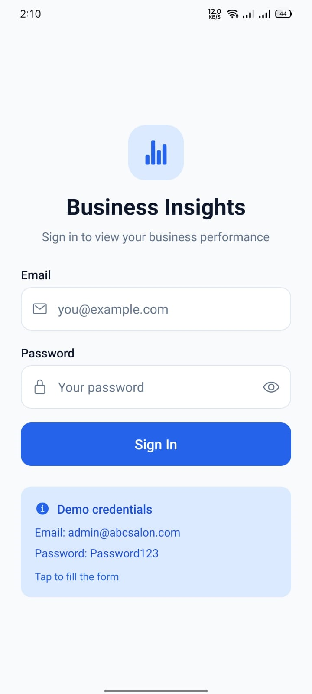
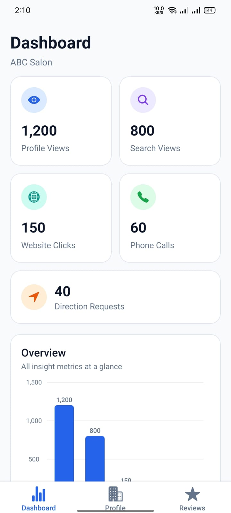
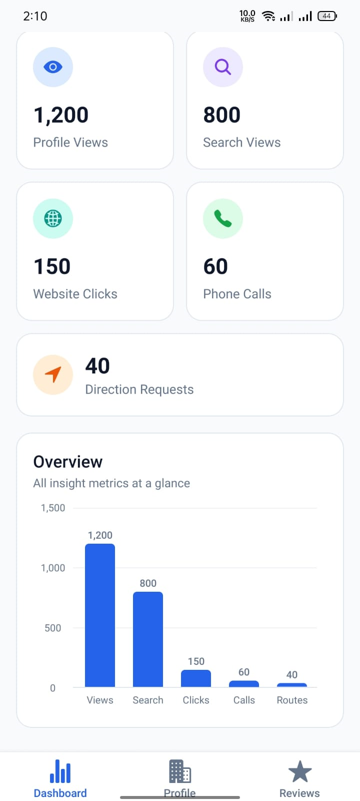
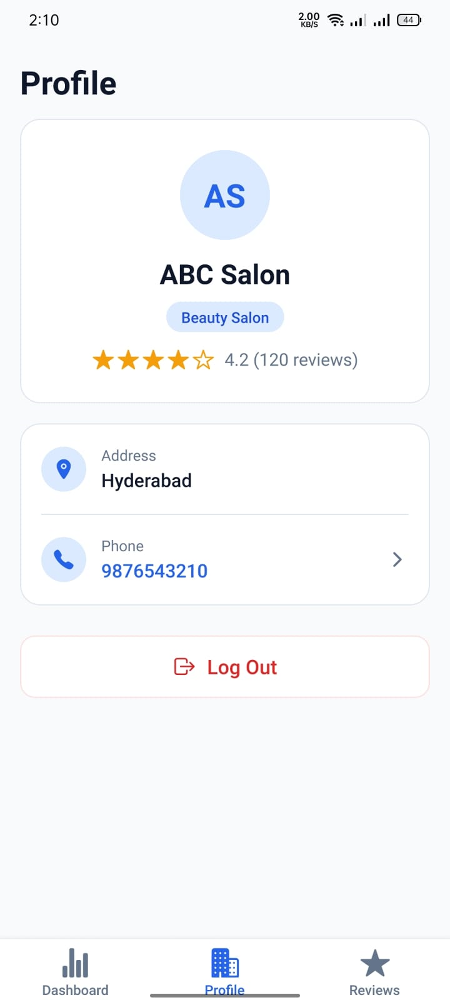
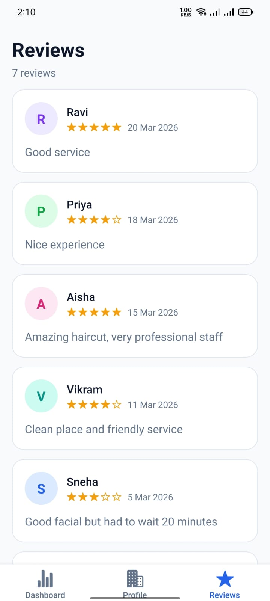
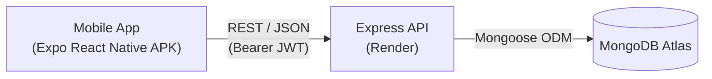

# Business Insights App

A full-stack mini "Google Business Profile" style dashboard: a React Native (Expo) mobile app backed by a Node.js/Express + MongoDB REST API, where a business owner logs in to view their profile, engagement insights (with a chart), and customer reviews.

`React Native (Expo)` · `Node.js` · `Express` · `MongoDB Atlas` · `Mongoose` · `JWT` · `bcrypt` · `Jest` · `Render` · `GitHub Actions`

---

## Screenshots

| Login | Dashboard | Insights Chart |
| --- | --- | --- |
|  |  |  |

| Business Profile | Reviews |
| --- | --- |
|  |  |

---

## Features

- **4 screens** — Login, Dashboard (insights), Business Profile, Reviews.
- **JWT authentication** — login issues a signed token; the three data endpoints require a `Bearer` token, and the app stores it securely and attaches it to every request.
- **Insights chart** — profile views, search views, website clicks, phone calls, and direction requests visualized on the dashboard.
- **UX states** — loading spinners, friendly error messages with retry, empty states, and automatic logout/redirect when the token is missing or rejected.

---

## Architecture



---

## Live API

Base URL: **https://business-insights-api-we6g.onrender.com**

> **Note:** the API is hosted on Render's free tier, which spins down after inactivity. The **first request after idle can take ~50 seconds** (cold start). Subsequent requests are fast. Hit `GET /health` first to warm it up.

---

## Demo Credentials

> **Email:** `admin@abcsalon.com`
> **Password:** `Password123`

This is the only seeded user — use it for the mobile app, Postman, and any manual API testing.

---

## API Reference

All endpoints are mounted at the **root** (no `/api` prefix), per the assignment spec.

| Method | Path | Auth | Description |
| --- | --- | --- | --- |
| GET | `/health` | No | Health check — confirms the API is running, returns uptime. |
| POST | `/login` | No | Authenticate with email + password, returns a JWT and user info. |
| GET | `/business` | Yes (Bearer JWT) | Business profile: name, category, address, phone, rating, total reviews. |
| GET | `/insights` | Yes (Bearer JWT) | Engagement metrics for the dashboard chart. |
| GET | `/reviews` | Yes (Bearer JWT) | Customer reviews, sorted by date descending (newest first). |

Every response — success **and** error, on every status code — uses the same envelope:

```json
{ "success": true, "message": "...", "data": {} }
```

**Sample success response** — `POST /login` (200):

```json
{
  "success": true,
  "message": "Login successful",
  "data": {
    "token": "<jwt>",
    "user": {
      "id": "<id>",
      "email": "admin@abcsalon.com"
    }
  }
}
```

**Standard error envelope** — e.g. any protected route without/with an invalid token (401):

```json
{
  "success": false,
  "message": "Unauthorized: token missing or invalid",
  "data": null
}
```

Other error messages follow the same shape: `400 "Email and password are required"`, `401 "Invalid email or password"`, `404` for unknown routes and for missing documents (`"Business not found"` / `"Insights not found"`).

Mongo internals never leak into responses: `_id` is mapped to `id`, `__v` is stripped, and password hashes are never serialized.

---

## Database

MongoDB Atlas database with four collections:

| Collection | Contents |
| --- | --- |
| `users` | The single demo user (`admin@abcsalon.com`) with a **bcrypt-hashed** password. |
| `businesses` | One business document — ABC Salon (Beauty Salon, Hyderabad, ☎ 9876543210, rating 4.2, 120 reviews). |
| `insights` | One metrics document — 1200 profile views, 800 search views, 150 website clicks, 60 phone calls, 40 direction requests. |
| `reviews` | Seven customer reviews (Ravi, Priya, Aisha, Vikram, Sneha, Rahul, Meera), served newest-first. |

All of it is created by the seed script (`npm run seed` in `backend/`).

---

## Project Structure

```text
business-insights-app/
├── backend/                 # Express + Mongoose REST API (JWT auth, seed script, Jest tests)
├── mobile/                  # Expo React Native app (4 screens, chart, secure token storage)
├── postman/                 # BusinessInsights.postman_collection.json (v2.1, auto token capture)
├── docs/
│   └── screenshots/         # App screenshots used in this README
└── .github/
    └── workflows/           # android-apk.yml — fallback APK build via GitHub Actions
```

---

## Backend Setup

```bash
cd backend
npm install
```

1. Copy `.env.example` to `.env` and fill in:
   - `MONGODB_URI` — your MongoDB Atlas connection string
   - `JWT_SECRET` — any long random string
2. Seed the database (creates the demo user, business, insights, and reviews):

```bash
npm run seed
```

3. Start the dev server — it listens on **http://localhost:5000**:

```bash
npm run dev
```

4. Run the test suite:

```bash
npm test
```

---

## Mobile Setup

```bash
cd mobile
npm install
```

Point the app at an API — either set `EXPO_PUBLIC_API_URL` (e.g. to `http://localhost:5000` for local dev, use your machine's LAN IP if testing on a physical device) or leave it unset to use the default live URL:

```bash
# optional — defaults to https://business-insights-api-we6g.onrender.com
set EXPO_PUBLIC_API_URL=https://business-insights-api-we6g.onrender.com   # Windows
# export EXPO_PUBLIC_API_URL=https://business-insights-api-we6g.onrender.com  # macOS/Linux
npx expo start
```

Scan the QR code with the **Expo Go** app on your phone.

---

## APK

| Source | Link |
| --- | --- |
| Direct APK download | [business-insights-v1.0.0.apk](https://github.com/faizanshoukat5/business-insights-app/releases/download/v1.0.0/business-insights-v1.0.0.apk) |
| Release page | [v1.0.0](https://github.com/faizanshoukat5/business-insights-app/releases/tag/v1.0.0) |

Build command (EAS):

```bash
eas build -p android --profile preview
```

A no-EAS fallback build is available as a GitHub Actions workflow (`.github/workflows/android-apk.yml`) — run **android-apk-fallback** from the Actions tab and download the APK artifact.

> **Install note:** since the APK is not from the Play Store, Android will ask you to **allow installs from unknown sources** for your browser/file manager, and Google Play Protect may show a "scan app" / "install anyway" prompt — this is expected for side-loaded demo builds.

---

## Postman

1. Import `postman/BusinessInsights.postman_collection.json` into Postman.
2. Run the **Login** request once — its test script auto-captures the JWT into the `token` collection variable.
3. That's it — **Get Business**, **Get Insights**, and **Get Reviews** inherit the collection-level Bearer auth and just work. Switch `base_url` to `http://localhost:5000` for local testing.

---

## Demo Video

_TODO — link added after recording (walkthrough of login → dashboard → profile → reviews + API demo)._

---

## Notes

- **Passwords are bcrypt-hashed.** The spec's sample data shows a plaintext password for readability, but the `users` collection intentionally stores only a bcrypt hash — you will never see `Password123` in the database.
- **Atlas network access is `0.0.0.0/0`.** Render's free-tier egress IPs are not fixed, so the Atlas IP allowlist is opened to all; access is still gated by the database username/password in the connection string.
- **Browser-pasting the data endpoints returns 401 by design.** `/business`, `/insights`, and `/reviews` are JWT-protected, so opening them directly in a browser (no `Authorization` header) returns a clean `401` JSON envelope — that's the auth working, not an outage. Use Postman or the app, or hit `/health` for an unauthenticated check.
